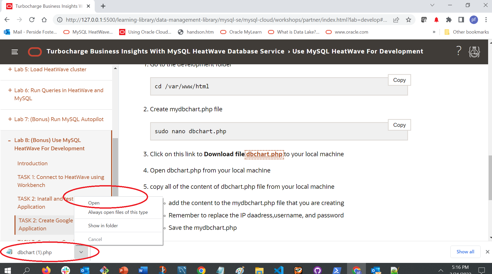
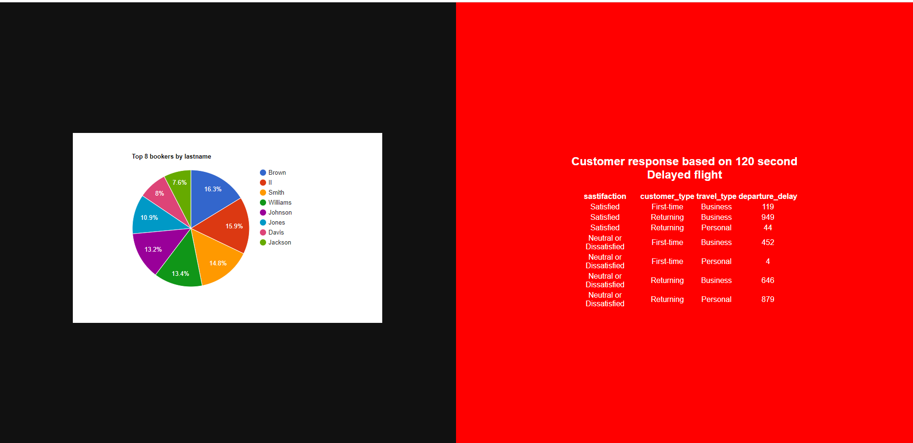
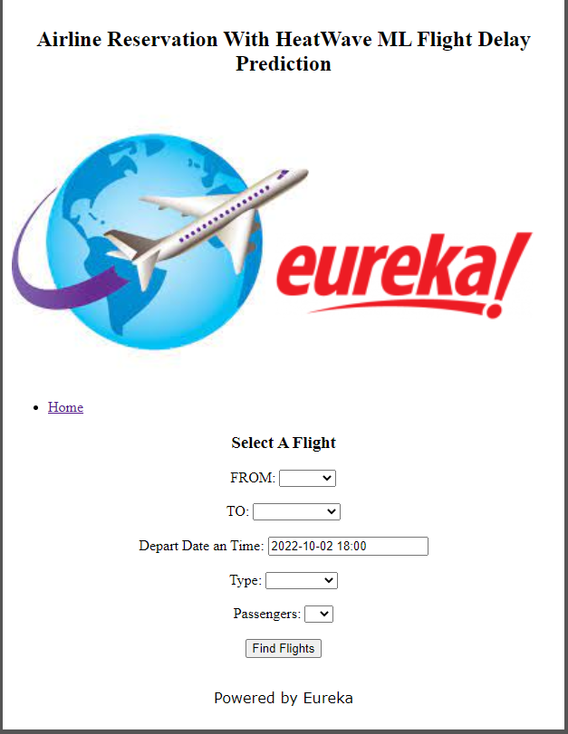

# Add HeatWave AutoML and Lakehouse Application to LAMP Server


## Introduction

MySQL HeatWave can easily be used for development tasks with existing Oracle services, such as Oracle Cloud Analytics. We will add 2 more applications to this LAMP server.


_Estimated Lab Time:_ 10 minutes

### Objectives

In this lab, you will be guided through the following tasks:

- Create Lakehouse Google Chart Application
- Create Application AutoML Application

### Prerequisites

- An Oracle Trial or Paid Cloud Account
- Some Experience with MySQL Shell
- Must Complete Lab 7

## Task 1: SSH into LAMP Development Server:

1. Go to Cloud shell to SSH into the new Compute Instance

     (Example: **ssh -i ~/.ssh/id_rsa opc@132.145.170...**) 

    ```bash
    <copy>ssh -i ~/.ssh/id_rsa opc@<your_compute_instance_ip></copy>
    ```

## Task 2: Create Google Chart Application to display Lakehouse data

1. Go to the development folder

    ```bash
    <copy>cd /var/www/html</copy>
    ```

2. Create mydbchart.php file

    ```bash
    <copy>sudo nano mydbchart.php</copy>
    ```

3. Click on this link to **Download file [dbchart.php](files/dbchart.php)**  to your local machine
4. Open dbchart.php from your local machine

    

5. copy all of the content of dbchart.php file from your local machine
    - add the content to the mydbchart.php file that you are  creating

        
    - Remember to replace the IP daadress,username, and password (lines 2 and 98 )
        - $con = mysqli_connect('30.0...','admin','Welcome#123','airportdb');
        - $link = mysqli_connect('30.0...','admin','Welcome#123','airportdb');
        
    - Save the mydbchart.php 

6. From your local  machine connect to dbtest.php

    Example: http://129.213.167..../mydbchart.php
    

## TASK 3: Create HeatWave ML Web App

1. Go to the development folder

    ```bash
    <copy>cd /var/www/html</copy>
    ```

2. Download application code

    ```bash
    <copy> sudo wget sudo wget https://objectstorage.us-ashburn-1.oraclecloud.com/p/OMLB9_8oVHM4o0eXb4sIRdI3K2jQ6F8ZSZAzpT1hsX9GkIqBUETRJw0AqRsH5RF9/n/mysqlpm/b/mysql_airport/o/airportapp_automl.zip</copy>
    ```

3. unzip Application code

    ```bash
    <copy>sudo unzip airportapp_automl.zip</copy>
    ```

    ```bash
    <copy>cd airportapp</copy>
    ```

4. Replace the database IP in config.php file with your heatwave database IP and save the file.

    ```bash
    <copy>sudo nano config.php</copy>
    ```

5. Run the application as follows:

    http://computeIP/airportapp/eureka_index.php

    

You may now **proceed to the next lab**

## Acknowledgements

- **Author** - Perside Foster, MySQL Principal Solution Engineering
- **Contributors** - Mandy Pang, MySQL Principal Product Manager,  Nick Mader, MySQL Global Channel Enablement & Strategy Manager
- **Last Updated By/Date** - Perside Foster, MySQL Solution Engineering, August 2023