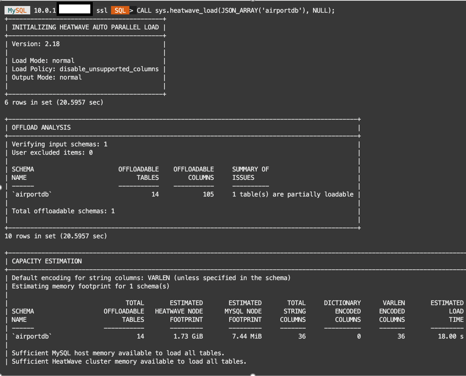
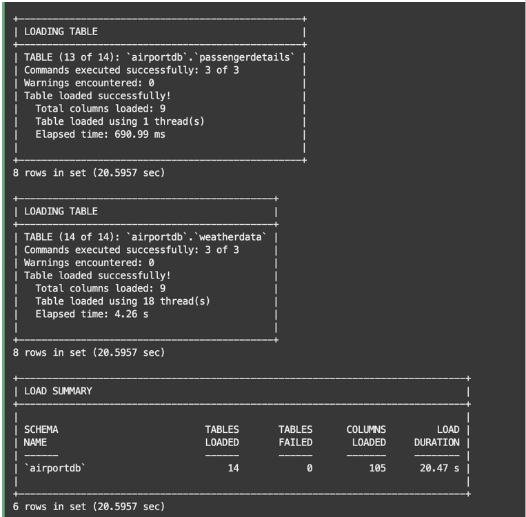

# Load Data into HeatWave Cluster 


## Introduction

A HeatWave cluster comprise of a MySQL DB System node and one or more HeatWave nodes. The MySQL DB System node includes a plugin that is responsible for cluster management, loading data into the HeatWave cluster, query scheduling, and returning query result.


Click the following link for an overview of the airportdb database structure:

- [Diagram of airportdb schema](https://dev.mysql.com/doc/airportdb/en/airportdb-structure.html).

_Estimated Time:_ 10 minutes

### Objectives

In this lab, you will be guided through the following task:

- Load Airportdb Data into HeatWave

### Prerequisites

- An Oracle Trial or Paid Cloud Account
- Some Experience with MySQL Shell
- Completed Lab 2

## Task 1: Load airportdb Data into HeatWave Cluster

1. Connect to OCI Cloud Shell
    

2. On command Line, connect to the HeatWave Database using the MySQL Shell client tool with the following command:

     ```bash
    <copy>mysqlsh -uadmin -p -h 10.0.1... --sql </copy>
    ```

    

3. Check to see if the airport data has been loaded in the HeatWave cluster. Loaded tables have an AVAIL_RPDGSTABSTATE load status.

     ```bash
    <copy>USE performance_schema;</copy>
    ```

     ```bash
    <copy>SELECT NAME, LOAD_STATUS FROM rpd_tables,rpd_table_id WHERE rpd_tables.ID = rpd_table_id.ID;</copy>
    ```

    

4. Run the following Auto Parallel Load command to load the airportdb tables into HeatWave..

     ```bash
    <copy>CALL sys.heatwave_load(JSON_ARRAY('airportdb'), NULL);</copy>
    ```

    

5. The completed load cluster screen should look like this:

    

6. Auto provisioning feature highlights:
    - a. **Load analysis box:** shows the number of tables/columns being loaded
    - b. **Capacity estimation box:** showis estimated memory and load time
    - c. **Loading table boxes:** use different thread to load based on the table
    - d. **Load summary box:** shows the actual load time
    - 

    - 

7. Verify that the tables are loaded in the HeatWave cluster. Loaded tables have an AVAIL_RPDGSTABSTATE load status.

     ```bash
    <copy>USE performance_schema;</copy>
    ```

     ```bash
    <copy>SELECT NAME, LOAD_STATUS FROM rpd_tables,rpd_table_id WHERE rpd_tables.ID = rpd_table_id.ID;</copy>
    ```

    

You may now **proceed to the next lab**

## Learn More

- [Oracle Cloud Infrastructure MySQL Database Service Documentation](https://docs.cloud.oracle.com/en-us/iaas/MySQL-database)
- [MySQL Database Documentation](https://www.MySQL.com)

You may now **proceed to the next lab**

## Acknowledgements

- **Author** - Perside Foster, MySQL Principal Solution Engineering
- **Contributors** - Mandy Pang, MySQL Principal Product Manager,  Nick Mader, MySQL Global Channel Enablement & Strategy Manager
- **Last Updated By/Date** - Perside Foster, MySQL Solution Engineering, July 2023