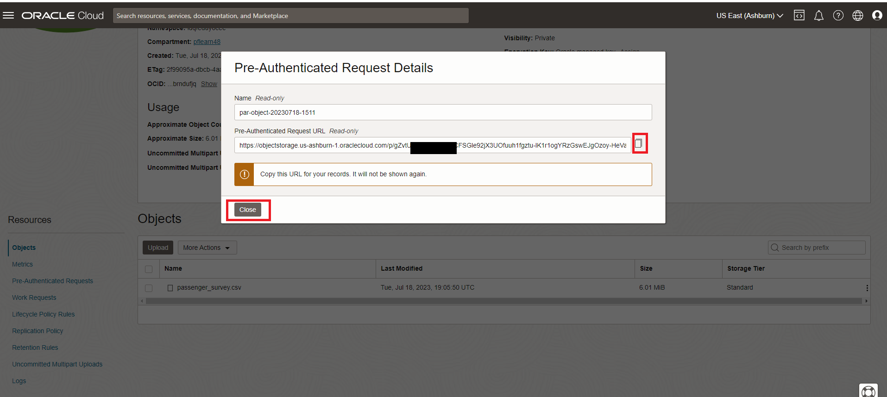
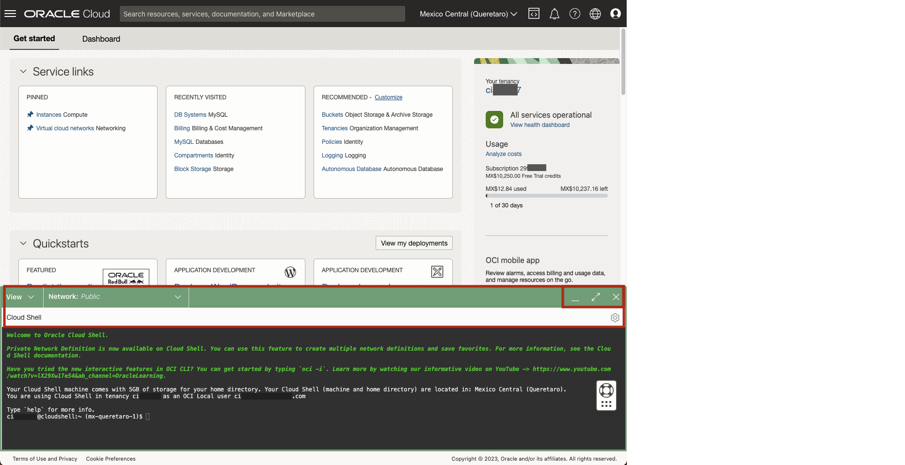

# Setup an LLM Chat + Generative AI responses with MySQL HeatWave


## Introduction

In this Lab, you will be guided into the process of setting up an AI Chat, leveraging MySQL Heatwave Generative AI which enable us to use an embeded LLM (Large Language Model) inside MySQL Database to start using a chatbot and later erich the provided answers with RAG (Retreival Augmented Generation), by providing text based documents as context for the answer generation.

When you run HeatWave Chat, it automatically loads the LLM model. If you don’t have a vector store set up, then
HeatWave Chat uses information available in public data sources to generate a response for your query. However, if
you have a vector store set up, then HeatWave Chat by default performs a global context search across all the loaded
vector store tables to generate a response for your query.

_Estimated Time:_ 10 minutes

### Objectives

In this lab, you will be guided through the following task:

- Add a HeatWave Cluster to MySQL Database System
- Load Airportdb Data into HeatWave

### Prerequisites

- An Oracle Trial or Paid Cloud Account
- Some Experience with MySQL Shell
- Completed Lab 6

## Task 1: Running the Chat. Use MySQL Heatwave chat function to generate text-based content


1. To delete previous chat output and state if any, reset the @chat_options session variable:

       ```bash
       <copy>set @chat_options=NULL; </copy>
       ```

2. Then, add your query to HeatWave Chat by using the heatwave_chat method:
**call sys.heatwave\_chat("<YourQuery>");**
For example:

       ```bash
       <copy>call sys.heatwave_chat("What is HeatWave AutoML?"); </copy>
       ```

3. You will get a response based on the LLM general training.

   

## Task 2: Add Text Based documents on OCI Object Store Buckets

1. In the Buckets page, click the **Your-Bucket-Name** name to load images into. The bucket's details page is displayed.
2. Under Resources, click Objects to display the list of objects in the bucket.
3. Click Upload under the default or custom folder. The Upload Objects pane is displayed.
4. Select a Text Based Document **Your-Document.pdf** file from your local machine
    - Click open to load the **Your-Document.pdf** file
    - Click the Upload button
      
       

    - Wait for the **Abort** to change into **close**
    - Click the **close** button

## Task 3: Create the PAR Link for the files

1. To create a PAR URL
    - Go to menu **Storage —> Buckets**
      
     

    - Select **Your-Custom-Folder**  folder.
2. Select your text based file —> **Your-Document.pdf** and click the three vertical dots.
3. Click on **Create Pre-Authenticated Request**

    

4. Choose the **Object-with-prefix** option.
5. Keep **Permit object reads** selected.
6. Kep the other options for **Access Type** unchanged.
7. Check the **Enable Object Listing** checkbox.
8. Click the **Create Pre-Authenticated Request** button.

    

9. Click the **Copy** icon to copy the PAR URL.
    

10. **Save the generated PAR URL**; you will need it in a task later

## Task 4: Create the vector store database for the vector tables

1. Connect to OCI Cloud Shell
    

2. On command Line, connect to the HeatWave Database using the MySQL Shell client tool with the following command:

       ```bash
       <copy>mysqlsh -uadmin -p -h 10.0.1... --sql </copy>
       ```

    

3. On command Line, Run the next command to create a database called **vectordb1**:
   
       ```bash
       <copy>CREATE SCHEMA vectordb1; </copy>
       ```
     
## Task 5: Load the Text Based documents into a vector table, using MySQL HeatWave AutoPilot

1. On command Line, Run the next command to SET a variable that stores the table and files parameter:
2. Name your table\_name with a name related to your text file, under **"table\_name": "tablename"**
3. Paste the **PAR** url copied from the task 2 and replace it under **"par": "https ://objectstorage.us-ashbu... "**

       ```bash
       <copy>
       SET @dl_tables = '[{
       "db_name": "vectordb1",
       "tables": [{
       "table_name": "HeatwaveInfo",
       "dialect": {
       "format": "pdf"
       },
       "file": [{
       "par": "https://objectstorage.us-ashburn-1.oraclecloud.com/p/BSbTtQqFXryq2fvx43cM3ueVK6F8ZfHIvycYOhwuW7NFESkvVlfVa3l21TG... "
       }]
       }]
       }]'; </copy>
       ```

4. On command Line, Run the next command to SET a variable that stores the database list

    ```bash
    <copy>SET @db_list = '["vectordb1"]'; </copy>
    ```
5. On command Line, Run the next command to SET a variable that stores the procedure options

    ```bash
    <copy>
    SET @options = JSON_OBJECT(
    'output', 'normal',
    'policy', 'disable_unsupported_columns',
    'external_tables', CAST(@dl_tables AS JSON)
    ); </copy>
    ```

7. On command Line, Run the next command to load the file into your **database.table** using the previous options

    ```bash
    <copy>CALL sys.heatwave_load(@db_list, @options); </copy>
    ```

## Task 6: Validate your new vector table with the text based document content

1. On command Line, Run the next command to Validate your **database.table** by counting the \# of Rows

    ```bash
    <copy>SELECT COUNT(*) FROM vectordb1.HeatwaveInfo; </copy>
    ```
2. On command Line, Run the next command to inspect the content of a row in your **database.table**

    ```bash
    <copy>SELECT * FROM vectordb1.HeatwaveInfo LIMIT 1\G </copy>
    ```

## Task 7: Compare the chat generated responses between general training and RAG responses

1. Re run your previous queries to HeatWave Chat by using the heatwave_chat method:
**call sys.heatwave\_chat("<YourQuery>");**
For example:

       ```bash
       <copy>call sys.heatwave_chat("What is HeatWave AutoML?"); </copy>
       ```

2. This time, you will get a response based on the Vector Store tables, with the Text Based Documents.
   

You may now **proceed to the next lab**

## Learn More

- [Oracle Cloud Infrastructure MySQL Database Service Documentation](https://docs.cloud.oracle.com/en-us/iaas/MySQL-database)
- [MySQL Database Documentation](https://www.MySQL.com)

You may now **proceed to the next lab**

## Acknowledgements

- **Author** - Cristian Aguilar, MySQL Principal Solution Engineering
- **Contributors** - Perside Foster, MySQL Solution Engineering
- **Last Updated By/Date** - Cristian Aguilar, MySQL Principal Solution Engineering, July 2024
